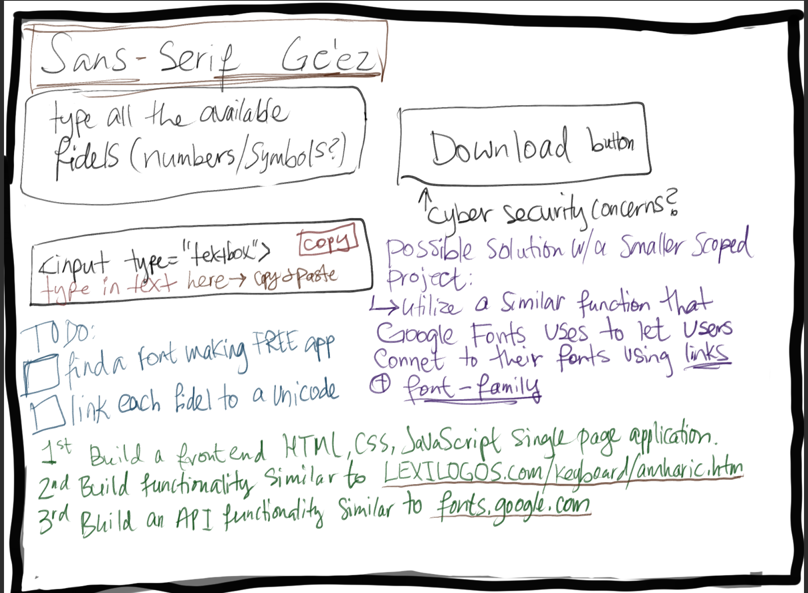

# Sans-Serif Ge'ez
I would like to create a website that provides a sans-serif font for Ge'ez script.
Some info on Ge'ez can be found on [wikipedia](https://en.wikipedia.org/wiki/Ge%CA%BDez_script).

## Background & Inspiration
My inspiration came from when I was in an intro to Ge'ez writing class and I noticed how those who are complete beginners would handwrite the 'fidels' or letters with all the little fourishes included. The only font that's out and in use has a lot of unnecessary flourishes that confuse and intimidate beginner Ethiopic language learners.
## Technologies Used
- HTML, CSS, JavaScript
- CLIP STUDIO PAINT PRO
## Challenges
- use vanilla JS/Jquery to automate placements of 189 fidels/alphabets instead of manually writing out the HTML for each <tr> <td>
## TODO
Here's an image of a rough draft of my plans to build a single page front-end website and later a Google Fonts - esque API with free Ge'ez sans-serif fonts. 

- 1st Build a front-end HTML, CSS & JavaScript single page application that's similar to that of [LEXILOGOS.com](https://www.lexilogos.com/keyboard/amharic.htm)
- 2nd Build an API (that will have an example of what your text would look like in my sans-serif Ge'ez font) and has functionality similar to [Google Fonts](https://fonts.google.com/).  
