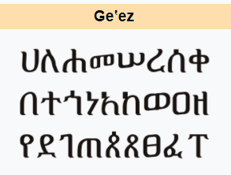

# Sans-Serif Ge'ez
I would like to create a website that provides a sans-serif font for Ge'ez script.
Some info on Ge'ez can be found on [wikipedia](https://en.wikipedia.org/wiki/Ge%CA%BDez_script).

## Background & Inspiration
My inspiration came from when I was in an intro to Ge'ez writing class and I noticed how those who are complete beginners would handwrite the 'fidels' or letters with all the little fourishes included. The only font that's out and in use has a lot of unnecessary flourishes that confuse and intimidate beginner Ethiopic language learners.
## Technologies Used
- HTML, CSS, JavaScript
- 